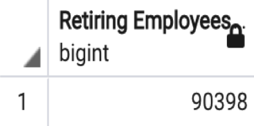
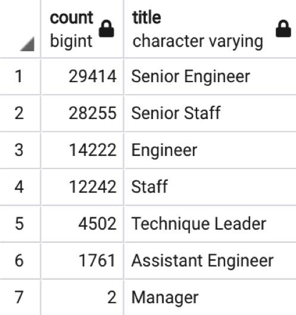
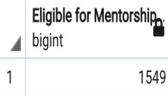

# Pewlett Hackard Retirement Analysis with SQL 

## Overview of Project

* Pewlett Hackard (PH) is a large company with several thousands of employees
* PH has started offering a retirement package to those meeting certain criteria and has begun looking for future employees in positions that will be left in the near future 
* Bobby is a HR analyst, whose task is to perform employee research

### Purpose

* Help Bobby build an employee database with SQL to aid his analysis
* Conduct an analysis that shows the number of retiring employees by title
* Conduct an analysis that shows the employees eligible for the PH Mentorship Program 
* Report the findings to assist PH's decision-making 

## Results: Four Discoveries

### Images

* See the number of employees retiring:

* See the number of retiring employees by title:

* See the number of employees eligible for a mentorship:

* Note: To see the full retiring_titles.csv, unique_titles.csv, and mentorship_eligibility.csv, view the tables in the Data folder

### Four Discoveries

1. 
2. 
3. 
4. 

## Summary
