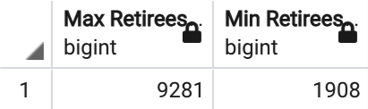
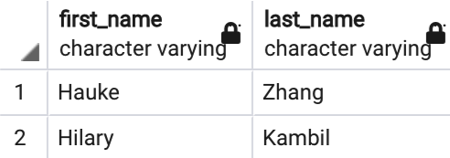

# Pewlett Hackard Retirement Analysis with SQL 

## Overview of Project

* Pewlett Hackard (PH) is a large company with several thousands of employees
* PH has started offering a retirement package to those meeting certain criteria and has begun looking for future employees in positions that will be left in the near future 
* Bobby is a HR analyst, whose task is to perform employee research

### Purpose

* Help Bobby build an employee database with SQL to aid his analysis
* Conduct an analysis that shows the number of retiring employees by title
* Conduct an analysis that shows the employees eligible for the PH Mentorship Program 
* Report the findings to assist PH's decision-making 

## Results: Four Discoveries

### Images

* See the number of employees retiring:

* See the number of retiring employees by title:

* See the number of employees eligible for the mentorship:

* Note: To see the full retiring_titles.csv, unique_titles.csv, and mentorship_eligibility.csv, view the tables in the Data folder.

### Four Discoveries

1. There are 90,398 employees retiring in the near future.
2. The two job titles with the most approaching retirees are Senior Engineer (29,414) and Senior Staff (28,255). Engineer (14,222) and Staff (12,242) are next. 
3. There are 2 managers about to retire. 
4. There are 1549 employees eligible for the mentorship. 

## Summary

### Questions

1. How many roles will need to be filled as the "silver tsunami" begins to make an impact?
2. Are there enough qualified, retirement-ready employees in the departments to mentor the next generation of Pewlett Hackard employees?

### Responses

1. As mentioned above, the silver tsunami consists of 90,398 employees retiring in the near future. These roles will need to be filled as more retirements occur.
2. The data suggests that there are more than enough retirement-ready employments ready to mentor the next generation of PH employees. With over 90K retirement-ready employees and 1549 employees eligible for the mentorship, PH likely has enough qualified, retirement-ready employees to mentor the next generation. 

### Additional Info 

1. The current_emp_count table shows that the Development department (d005) has the most employees retiring in the near future and the Finance department (d002) has the fewest. The current_emp_count table can be seen in the Data folder.

See Max and Min upcoming retirees: 

2. The manager_info table needs clarification. The table displays 5 managers as active, while only 2 have the to_date = '1/1/99.' The '1/1/99' in the table is short for '9999-01-01,' which represents active employees or managers. Now, 3 managers appear in manager_info who stopped being a manager in 1992, 1996, and 1988, respectively. It is important to note that they appear in the table as a result of the JOIN with the current_emp table. These 3 managers are no longer managers but remain current employees. This information is important because PH should focus on replacing 2 managers, Huake Zhang from Sales and Hilary Kambil from Research, instead of replacing 5 managers. 

The manager_info table can be viewed in the Data folder.

See upcoming retiring managers:

